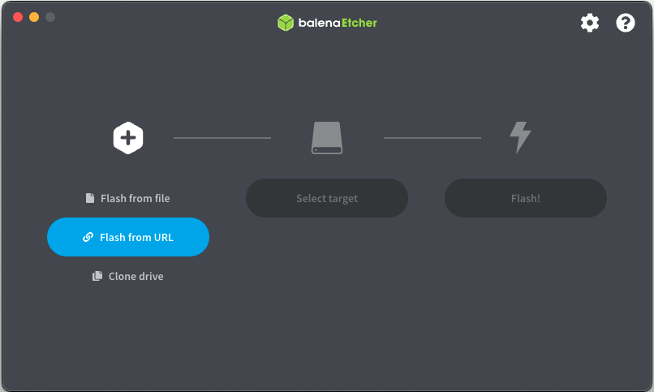
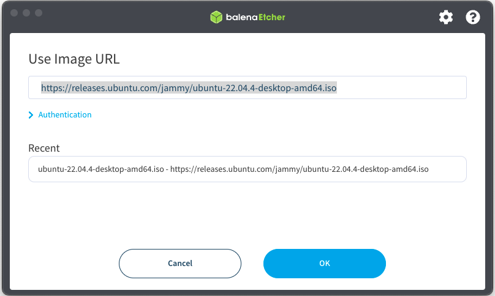
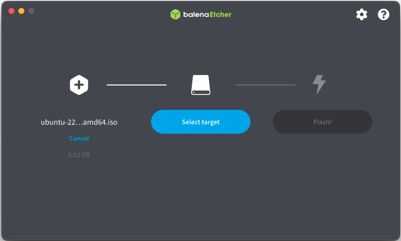
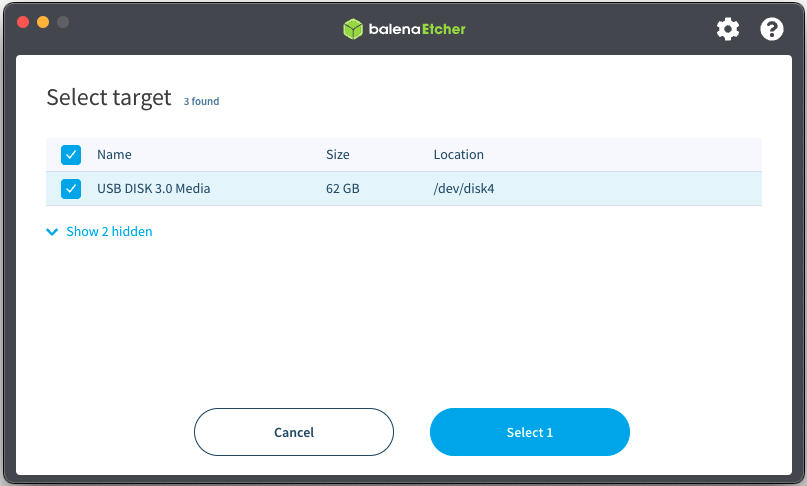
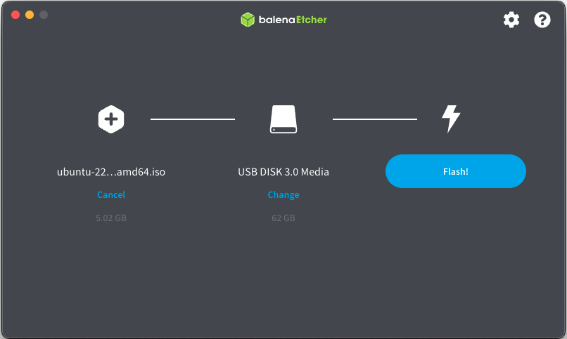

# Configuring a Kiosk on a Windows Surface Tablet with Ubuntu

The following procedures and the accompanying Ansible script will configure a Windows Surface tablet with the Ubuntu OS and a configured Kiosk Mode. It includes configurations for locking down the Firefox browser to prevent user actions such as opening new browser pages, changing configurations etc. The sample configuration in the repository use [Yahoo Finance](https://finance.yahoo.com/) as the sample page but the purpose of this repository is to configure a Kiosk for single page applications.

The procedures below were tested with the following:

* Tablet: Windows Surface Pro 7 i7 16GB RAM 256GB SSD (other later versions may likely work)
* Tablet OS: Ubuntu 22.04 AMD64
* Provisioning Machine OS: Ubuntu 22.04 (Can be provisioned from and OSX machine but the software install procedures will vary)

**Note**: These procedures assume you have some knowledge of Linux and use of the Linux terminal. 

<!--TDD Add note for referring to article -->

## Preparing the Tablet for Provisioning

Prior to being provisioned, the Microsoft Tablet must be loaded with the Ubuntu Unity operating system and it most be configured with an SSH server for remote provisioning. This is a one time setup on a clean tablet that will be provisioned. Once the tablet has been configured for provisioning, you can re-provision it or you can choose to start from a fresh install by re-installing the Ubunto OS. 

### Creating a USB installer

1. Download the ISO Ubuntu distribution from [here](https://releases.ubuntu.com/jammy/ubuntu-22.04.4-desktop-amd64.iso)

2. Install [Balena Etcher](https://etcher.balena.io/). This is a utility for creating bootable USB drives. It will be used to create the bootable Linux operating system from which we can install from. Downloads are provided for Windows, OSX and Linux platforms.

3. Plug in the USB drive and format it the USB drive to exFat or  FAT32.  

4. Open the Balena Etcher application and select *Flash from URL*.

	 

5. In the panel that appears next, enter in the following URL:

	```
	https://releases.ubuntu.com/jammy/ubuntu-22.04.4-desktop-amd64.iso
	```

	 

6. Click the **Ok** button. In the next panel click on the **Select target** button. 


	 

7. In the next panel that appears, select your USB drive.

	 

8. Click on the **Select 1** button

9. In the next panel that appears, click on the **Flash!** button. 

	 

## Configuring the Tablet

1. Plug in the bootable USB to the Tablet USB port. Plug in a Windows tablet keyboard with a mouse pad. When the OS first installs, it will not have support for touch screen so this will be your best option for interacting with the installer. At certain points in the installation process, you may notice your mouse pointer hesitating. You can use the tab key to naviage around when this occurs.
2. Shut down your Surface.
3. Press and hold the volume-down button on your Surface.
4.  While holding the volume-down button, press and release the power button. You’ll see the Microsoft or Surface logo on your screen. Continue holding the volume-down button until you see spinning dots beneath the logo. This should bring you to the UEFI settings. 

	 

5. Select **Security** from the left side menu. This will bring you to the _Security_ settings. 

	 

6. Click on the **Change configuration** button and in the dialog that comes up, select the option for _None_ then press the **OK** button. This will return you to the UEFI settings. 

7. Select **Boot Configuration** from the left side menu. This will bring you to the _Boot Configuration_ settings. 

	 
 
8. Deselect all the check boxes and select only _USB Storage_

9. In the _Advanced Options_ section, ensure that the _Enable Boot from USB devices_ is switched to the _On_ position. All others should be switched to the _Off_ position. 

10. Click on the **Exit** option button the left side menu. 

11. Click on the **Restart Now** button. This should boot you into the operating system. The tablet should now boot into a Linux OS. **Note**: At this point do not select any options from the startup menu in the terminal. Allow it to enter into the graphical UI. 

12. When the OS finishes booting, you should see a dialog with an option to **Install Ubuntu** or **Try Ubuntu**. Select the option for **Install Ubuntu**. You can refer to [these](https://www.linux.org/threads/ubuntu-22-04-on-surface-pro-7.43071/) directions for additional info.

13. In the first dialog that appers, configure a WiFi network connection by clicking on the network SSID and clicking on the **Connect** button. 

14. Fill in the WiFi password in the dialog then click on the **Connect** button. 
15. When the dialog closes, click on the **Continue** button. This will take you to the _Updates and other software_ dialog. 
16. Click on the radio button for _Minimal installation_, leave the other defaults then click on the **Continue** button. It may take some time to respond at this point but eventually it will take you the the _Installation type_ dialog. 
17. Select _Erase disk and install Ubuntu_. Don't configure any of the advanced options since we want to use the entire drive space for Linux and the default partitions should be sufficient. 
18. Click on the _Continue_ button. This will bring you the the _Erase disk and install Ubuntu_ dialog. 
19. Click on the _Install Now_ button. In the dialog that comes up, click on the _Continue_ button. This will take you the dialog to select your location.
20. Select your location then click on the _Continue_ button. This will take you to the _Who are you?_ dialog.
21. Enter in a name of a user. This will default the next two entries.
22. Change the computer name to something unique
23. Enter in a password
24. Confirm the password
25. Ensure that the _Require my password to log in_ radio button is enabled. 
26. Click on the **Continue** button. This will commence the installation.  
27. At the end of the installation a dialog box will appear. Click on the **Restart Now** button. This will rebot the OS. When it comes back up it will prompt you to remove the installation medium. 
28. Remove the USB drive at this point then press the **Enter** key. 
29. After the OS reboots again, log in as the user you just created. 
30. Open a terminal window. This can be done by clicking on the circular search icon on the upper left hand side of the desktop and keying in "Terminal" to find the terminal. Alternately, you can click on the 	 key on your keyboard and search from there. 
31. In the terminal, run the following command:
	
	```
	sudo apt install -y openssh-server
	sudo shutdown -r now
	```
	When prompted, enter the password you used when you created your user account. Once the tablet has rebooted, you should be able to use an SSH client and SSH into the machine.
32. Log back in.
33.	Click on the _WiFi_ icon in the upper right hand corner and select **Settings**. This will take you to the _WiFi Settings_ dialog.
34. Click on the settings icon to the right of the network you are connected to. This will bring up a dialog with the network information. Take note of this IPV4 Address as you will need it for Ansible provisioning. Miltiple tablets can be provisioned at the same time with the Ansible script so it would be advisable to first perform the OS install an multiple tablets, leave them running and note the IP address of each one. 		

**Note**: It is advantageous to have a static IP address for the tablet as it may change its address after rebooting. Since this is a Kiosk, you'll have no acccess from the UI to configure the WiFi so you will have to rely on your router to tell you what address the tablet is assigned. A static address eleminates this problem as it will always have the same address. Refer to your home router's documentation on configuring a static address. 
35. Test the network connectivity from your provisioning machine to each of the tablets with the following step (with a an OS X or Linux machine):
	
	```
	ssh {username}@{tablet IP addres noted above from the WiFi configuration}
	```
	If you are prompted for a password, you are able to reach the machine. **Note**: Your provisioning machine must be on the same network as the tablet(s).


## Installing the software on the provisioning
This is the software required to run the Ansible script. The procedures for installation are specific to Ubuntu but the scripts will run on OSX if the same software is installed.


1. **Install the Git client** 

	Execute the following commands in the terminal:
	
	```
	sudo apt update
	sudo apt install git
	```
	
	If you have trouble install this, see this [article](https://www.digitalocean.com/community/tutorials/how-to-install-git-on-ubuntu) for installing the Git client.

2. **Install the Ansible client**

	Execute the following commands in the terminal:

	```
	sudo apt update
	sudo apt install software-properties-common
	sudo add-apt-repository --yes --update ppa:ansible/ansible
	sudo apt install ansible
	```
3. Check out the source from the repository by executing the following commands in the terminal:

	```
	cd ~
	git clone https://github.com/aiacovella/windows-tablet-ubuntu-kiosk.git
	```
	 If you followed the directions above, you should have a directory named _windows-tablet-ubuntu-kiosk_ under your home directory. This will be referred to as the project root going forward. 
	
4. Edit the _hosts.ini_ file located under the project root directory and add the ip address(s) of your tablets under the _[ubuntu]_ section. Each entry will be a combination of a host alias and an IP address as seen in the example below:

	```
	[ubuntu]
	my_host_one=192.168.1.40
	
	```
	If you are provisioning multiple tablets, you can add an entry for each one here. **Note**: Be sure that each entry has its own individual alias.
	
	In the sample above, [ubuntu] is a grouping. If you want to maintain separate lists for tablets, you can add new groupings. When executing the ansible script there are various options for targeting host devices. For our example we will be targeting only one device. Refer to [this](https://docs.ansible.com/ansible/latest/inventory_guide/intro_patterns.html) documentation for more information on targeting devices. 
	

5. Edit the _firefox-frame.service_ file in the project route. In there you'll find a line that looks like the following:

	```
	ExecStart=/snap/bin/firefox --kiosk www.amazon.com
	```

	This line in the service definition specifies which command to run when the service starts up. In this case, it launches Firefox with the the _--kiosk_ option and the URL to open the browser with. You can replace the url with your own custom URL. 	

6. Edit the _policies.json_ file in the project route to add restrictions to specific domains. You can add a section to the policies file for _WebsiteFilter_ to block all URL's and allow specific ones or block specific ones. The following is an example configuration for _amazon.com_. It is purposly left out for this example since their website links to numerous other domains an it was easier to leave it out for our example. The following is an example of allowing only specific URL's:

	```
	"WebsiteFilter": {
	  "Block": ["<all_urls>"],
	  "Exceptions": [
	    "https://amazon.com/",
	    "http://amazon.com/",
	    "https://amazon.com/*",
	    "http://amazon.com/*"
	  ]
	}
	```
	
	It is recommended that you start without this until you have everything configured and provisioning the tablet. For additional informaiton on configuring other policies refer to the documentation for [policy templates](https://mozilla.github.io/policy-templates/).


7. In the _root_ directory of this project, run the ansible playbook to perform the installation onto your tablet with the following command in the root directory of this project. This command will require some values to be filled in. 

	Using this example as a template, replace the _{username}_ entry with the name of the user you created while installing the OS onto the tablet and replace each of the two _{password}_ entries with the password you assigned to the uer when you installed the OS.
	
	```
	ansible-playbook -u {username} playbook_ubuntu_firefox_frame.yml --extra-vars 'ansible_ssh_pass={password}  ansible_become_pass={password}'
	```

	The above command will target all devices in the _hosts.ini_ file. If you wish to target a specific device you can specify it by it's alias as in the following template example where _my_host_one_ is specified:
	
	```
	ansible-playbook  -l my_host_one -u {username} playbook_ubuntu_firefox_frame.yml --extra-vars 'ansible_ssh_pass={password}  ansible_become_pass={password}'
	```
	
	Once the script reaches the end, it will reboot your tablet. After the tablet reboots, there is a short period of time before the browser comes up. 


	

